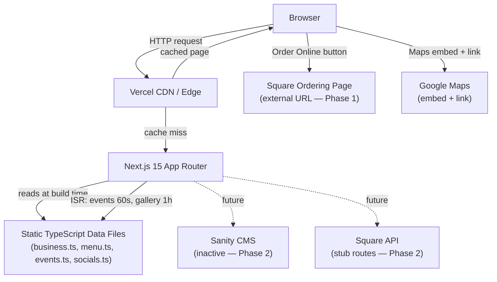
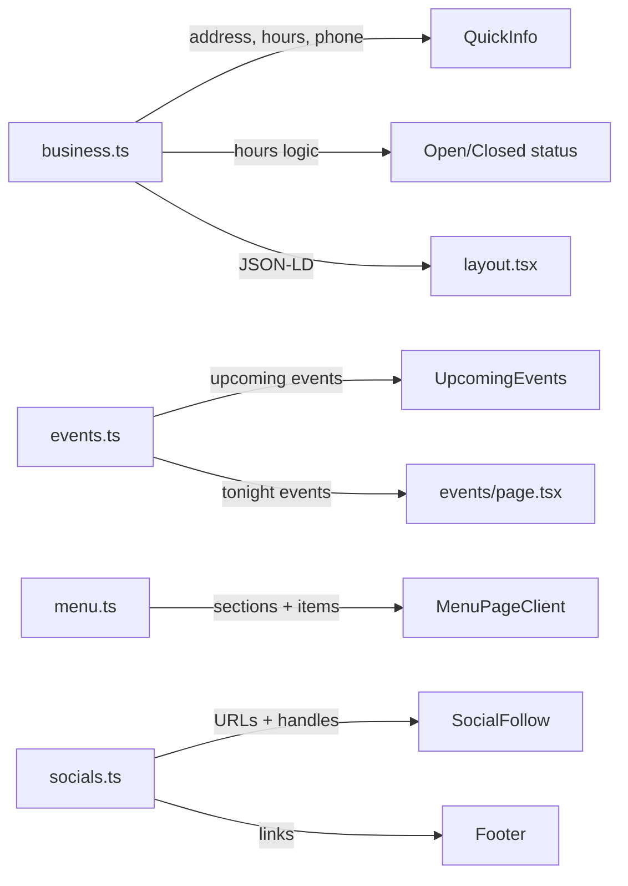
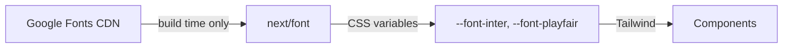
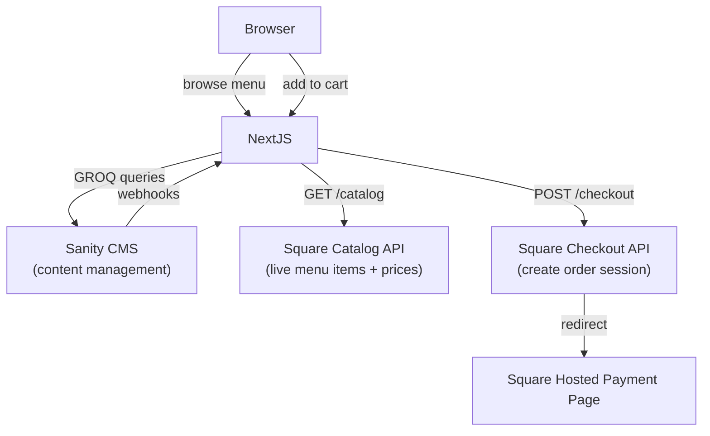

# Architecture — The Merc Website

**Last updated:** 2026-09-08

---

## Overview

The Merc website is a statically generated Next.js 15 application with no backend, no database, and no authentication. All content lives in TypeScript data files. The site is designed to grow into a full Square-integrated ordering experience in Phase 2.

---

## Request Flow



---

## Page Generation Strategy

| Page | Strategy | Revalidation |
|---|---|---|
| `/` (Home) | Static | Never (build time) |
| `/menu` | Static | Never |
| `/events` | ISR | 60 seconds |
| `/gallery` | ISR | 1 hour |
| `/about` | Static | Never |
| `/visit` | Static | Never |
| `/sitemap.xml` | Static | Build time |
| `/robots.txt` | Static | Build time |
| `/api/square/catalog` | Server (API route) | On demand |
| `/api/square/checkout` | Server (API route) | On demand |

Events and gallery use ISR to be CMS-ready when Sanity is activated.

---

## Directory Structure

```
The Merc/
├── app/                        Next.js App Router
│   ├── layout.tsx              Root layout: metadata, fonts, JSON-LD, nav, footer
│   ├── page.tsx                Home page — assembles home section components
│   ├── globals.css             Design system: CSS variables, buttons, badges, utilities
│   ├── not-found.tsx           Custom 404
│   ├── robots.ts               Auto-generated robots.txt
│   ├── sitemap.ts              Auto-generated sitemap.xml
│   ├── about/page.tsx
│   ├── events/page.tsx
│   ├── gallery/page.tsx
│   ├── menu/page.tsx
│   ├── visit/page.tsx
│   └── api/
│       └── square/
│           ├── catalog/route.ts    GET stub — returns 503 if unconfigured
│           └── checkout/route.ts   POST stub — returns 503 if unconfigured
├── components/
│   ├── home/                   Home page sections (one component per section)
│   │   ├── Hero.tsx
│   │   ├── QuickInfo.tsx       Open status, hours today, phone, address, CTA buttons
│   │   ├── Welcome.tsx
│   │   ├── FoodDrink.tsx       Food & drink feature grid
│   │   ├── UpcomingEvents.tsx
│   │   ├── DakotaJoe.tsx
│   │   ├── SocialFollow.tsx
│   │   └── VisitCTA.tsx
│   ├── layout/
│   │   ├── Navbar.tsx          Desktop top nav
│   │   ├── Footer.tsx          Footer + spacer for mobile bottom bar
│   │   └── MobileBottomBar.tsx Mobile bottom navigation (icons + labels)
│   ├── menu/
│   │   └── MenuPageClient.tsx  Client component — tabbed menu interface
│   └── ui/                     Shared primitive components
│       ├── OrderOnlineButton.tsx
│       ├── SectionHeader.tsx
│       ├── PlaceholderImage.tsx
│       └── TikTokIcon.tsx
├── data/                       Static content — edit these to update site content
│   ├── business.ts             Address, phone, hours, features, helper functions
│   ├── events.ts               Events list + helper functions
│   ├── menu.ts                 Menu sections and items
│   └── socials.ts              Social media URLs and handles
├── lib/
│   └── sanity/                 Sanity client + GROQ queries (inactive)
├── public/
│   ├── favicon.ico             16×16 ICO, amber M on dark background
│   ├── favicon.svg             SVG favicon, brand colors
│   └── images/                 All site images (local, not CDN)
├── studio/                     Sanity Studio (separate app, not deployed)
├── .env.local                  Environment variables (not in git)
├── .env.example                Variable name template (in git)
├── next.config.ts              Security headers, image config
├── tailwind.config.ts          Brand tokens: colors, fonts, spacing, shadows
├── tsconfig.json
└── CLAUDE.md                   AI assistant context
```

---

## Design System

### Brand Tokens (tailwind.config.ts)

```
Colors:
  merc-dark    #1C1C1A   — primary dark background
  merc-amber   #C4842A   — primary accent (gold/amber)
  merc-cream   #F5F0E8   — warm off-white text
  merc-brown   #3D2B1F   — rich dark brown

Typography:
  font-display   Playfair Display (serif) — headings, brand text
  font-body      Inter (sans-serif) — body, UI
  (both loaded via next/font at build time — no runtime Google Fonts request)

Spacing/Shadow: standard Tailwind with custom 'merc' named values
```

### CSS Variables (globals.css)

Custom properties for colors, button styles, badge styles, and section utilities. These cascade through the entire application.

---

## Data Layer

All site content is defined in static TypeScript files. No database, no CMS queries at runtime.



### Key Helper Functions

| Function | File | Purpose |
|---|---|---|
| `getTodayHours()` | `data/business.ts` | Returns today's hours entry using Central Time |
| `getOpenStatus()` | `data/business.ts` | Returns `{status, closesAt/opensAt}` in Central Time |
| `getUpcomingEvents()` | `data/events.ts` | Events from now forward, sorted by date |
| `getTonightEvents()` | `data/events.ts` | Events happening today |
| `formatTime()` | `data/events.ts` | 24h → "7:00 PM" |
| `formatEventDate()` | `data/events.ts` | Date → "Friday, September 6" |

---

## Security Architecture

### HTTP Headers (next.config.ts)

Applied to all routes via `headers()` config:

| Header | Value | Purpose |
|---|---|---|
| `X-Content-Type-Options` | `nosniff` | Prevent MIME sniffing |
| `X-Frame-Options` | `SAMEORIGIN` | Clickjacking protection |
| `Referrer-Policy` | `strict-origin-when-cross-origin` | Limit referrer leakage |
| `Permissions-Policy` | `camera=(), microphone=(), geolocation=()` | Disable unused browser APIs |
| `X-DNS-Prefetch-Control` | `on` | Improve link prefetch performance |

**Not yet implemented:** Content-Security-Policy (requires nonce architecture with Google Fonts + Maps)

### Secret Isolation

- `SQUARE_ACCESS_TOKEN` — server-side only, never `NEXT_PUBLIC_`
- API routes return generic errors, no internal details exposed
- All external links use `rel="noopener noreferrer"`
- `dangerouslySetInnerHTML` used only for JSON-LD structured data (safe: no user input)

### JSON-LD Structured Data (layout.tsx)

Three schema types output on every page:
- `Restaurant` — primary business schema
- `BarOrPub` — secondary type
- `LocalBusiness` — tertiary type

Includes: name, address, phone, hours, geo coordinates, social profiles, cuisine type.

---

## Font Loading



Fonts are fetched once at build time and served from the same domain — no runtime Google Fonts requests, no FOUT.

---

## ISR Architecture

Events and Gallery pages use Incremental Static Regeneration:

```typescript
export const revalidate = 60  // events: 60 seconds
export const revalidate = 3600  // gallery: 1 hour
```

When Sanity CMS is activated, these pages will re-fetch from Sanity on revalidation. Currently they re-read the same static data files (no visible change, but the pattern is CMS-ready).

---

## Phase 2 Architecture (Planned)



API routes at `/api/square/catalog` and `/api/square/checkout` are already scaffolded with proper validation, error handling, and environment variable checks.
